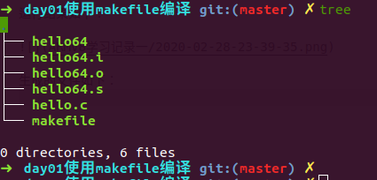
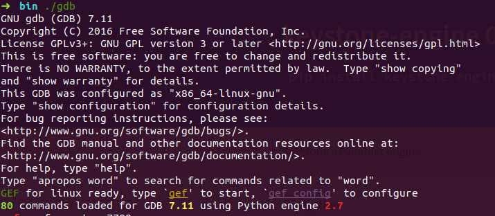
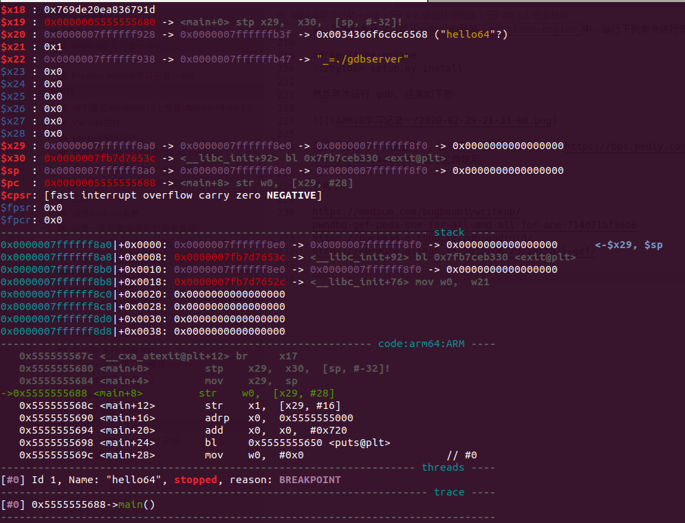
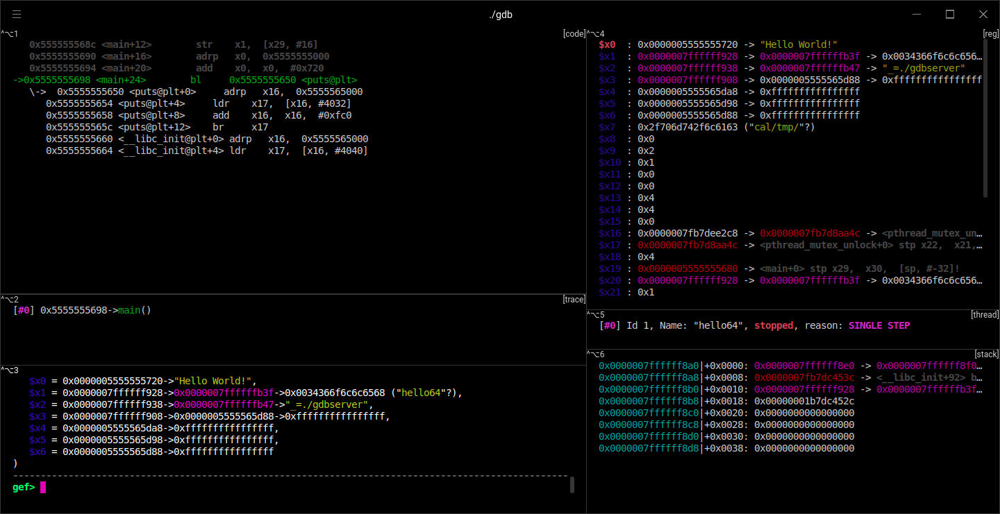

<!-- TOC -->

- [1. 从一个 HelloWorld 开始](#1-从一个-helloworld-开始)
	- [1.1. 利用编译器创建一个 ARMv8 的源文件](#11-利用编译器创建一个-armv8-的源文件)
- [2. 调试环境搭建](#2-调试环境搭建)
	- [2.1. 安装 gef](#21-安装-gef)
	- [2.2. 安装模块](#22-安装模块)

<!-- /TOC -->
# 1. 从一个 HelloWorld 开始
## 1.1. 利用编译器创建一个 ARMv8 的源文件
由于我们主要学习ARMv8的指令，所以直接使用 C 源文件生成一个 ARMv8的汇编源文件。

C 代码如下：
```
// hello.c
#include<stdio.h>
int main(int argc, char const *argv[]){
    printf("Hello World!\r\n");
    return 0;
}
```
makefile 如下：
```
#文件名称
MODALE_NAME=hello

#ndk根目录
NDK_ROOT = $(HOME)/DevTool/AndroidSdk/ndk-bundle
#编译器根目录
TOOLCHAINS_ROOT_ARM=$(NDK_ROOT)/toolchains/arm-linux-androideabi-4.9/prebuilt/linux-x86_64
TOOLCHAINS_ROOT_AARCH64=$(NDK_ROOT)/toolchains/aarch64-linux-android-4.9/prebuilt/linux-x86_64
#编译器目录
TOOLCHAINS_PREFIX=$(TOOLCHAINS_ROOT_ARM)/bin/arm-linux-androideabi
TOOLCHAINS_PREFIX_AARCH64=$(TOOLCHAINS_ROOT_AARCH64)/bin/aarch64-linux-android

#头文件搜索路径
TOOLCHAINS_INCLUDE=$(TOOLCHAINS_ROOT_ARM)/lib/gcc/arm-linux-androideabi/4.9.x/include-fixed
TOOLCHAINS_INCLUDE_AARCH64=$(TOOLCHAINS_ROOT_AARCH64)/lib/gcc/aarch64-linux-android/4.9.x/include-fixed

#SDK根目录
PLATFROM_ROOT=$(NDK_ROOT)/platforms/android-21/arch-arm
PLATFROM_ROOT_AARCH64=$(NDK_ROOT)/platforms/android-21/arch-arm64

#sdk头文件搜索路径
PLATFROM_INCLUDE=$(PLATFROM_ROOT)/usr/include
PLATFROM_INCLUDE_AARCH64=$(PLATFROM_ROOT_AARCH64)/usr/include

#sdk库文件搜索路径
PLATFROM_LIB=$(PLATFROM_ROOT)/usr/lib
PLATFROM_LIB_AARCH64=$(PLATFROM_ROOT_AARCH64)/usr/lib

#删除
RM=del

#编译选项
FLAGS=-I$(TOOLCHAINS_INCLUDE) \
      -I$(PLATFROM_INCLUDE)   \
      -L$(PLATFROM_LIB) \
      -nostdlib \
      -lgcc \
      -Bdynamic \
      -lc \
      -fPIE

FLAGS_AARCH64=-I$(TOOLCHAINS_INCLUDE_AARCH64) \
      -I$(PLATFROM_INCLUDE_AARCH64)   \
      -L$(PLATFROM_LIB_AARCH64) \
      -nostdlib \
      -lgcc \
      -Bdynamic \
      -lc \
      -fPIE

#所有obj文件
OBJS=$(MODALE_NAME).o \
     $(PLATFROM_LIB)/crtbegin_dynamic.o \
     $(PLATFROM_LIB)/crtend_android.o 

OBJS_AARCH64=$(MODALE_NAME)64.o \
     $(PLATFROM_LIB_AARCH64)/crtbegin_dynamic.o \
     $(PLATFROM_LIB_AARCH64)/crtend_android.o 

#编译器链接
all:
	$(TOOLCHAINS_PREFIX)-gcc $(FLAGS) -E $(MODALE_NAME).c -o $(MODALE_NAME).i
	$(TOOLCHAINS_PREFIX)-gcc $(FLAGS)  -S $(MODALE_NAME).i -o $(MODALE_NAME).s
	$(TOOLCHAINS_PREFIX)-gcc $(FLAGS) -c $(MODALE_NAME).s -o $(MODALE_NAME).o
	$(TOOLCHAINS_PREFIX)-gcc $(FLAGS) $(OBJS) -fPIE -pie -o $(MODALE_NAME)

all64:
	$(TOOLCHAINS_PREFIX_AARCH64)-gcc $(FLAGS_AARCH64) -E $(MODALE_NAME).c -o $(MODALE_NAME)64.i
	$(TOOLCHAINS_PREFIX_AARCH64)-gcc $(FLAGS_AARCH64)  -S $(MODALE_NAME)64.i -o $(MODALE_NAME)64.s
	$(TOOLCHAINS_PREFIX_AARCH64)-gcc $(FLAGS_AARCH64) -c $(MODALE_NAME)64.s -o $(MODALE_NAME)64.o
	$(TOOLCHAINS_PREFIX_AARCH64)-gcc $(FLAGS_AARCH64) $(OBJS_AARCH64) -fPIE -pie -o $(MODALE_NAME)64
#删除所有.o文件
clean:
	$(RM) *.o
#安装程序到手机
install:
	adb push $(MODALE_NAME) /data/local/tmp
	adb shell chmod 755 /data/local/tmp/$(MODALE_NAME)
	adb shell /data/local/tmp/$(MODALE_NAME) 
debug:
	adb forward tcp:23946 tcp:23946
	adb shell /data/local/tmp/android_server

install64:
	adb push $(MODALE_NAME)64 /data/local/tmp
	adb shell chmod 755 /data/local/tmp/$(MODALE_NAME)64
	adb shell /data/local/tmp/$(MODALE_NAME)64 

debug64:
	adb forward tcp:23946 tcp:23946
	adb shell /data/local/tmp/android_server64
#运行程序
run:
	adb shell /data/local/tmp/$(MODALE_NAME)  

run64:
	adb shell /data/local/tmp/$(MODALE_NAME)64 


```
使用 `make all64` 命令编译后的结果：


运行结果如下：


生成的文件如下：



`hello64.s` 对应的内容，后面所有的指令学习将一次文件为基础进行修改。
```
	.cpu generic+fp+simd
	.file	"hello.c"
	.section	.rodata
	.align	3
.LC0:
	.string	"Hello World!\r"
	.text
	.align	2
	.global	main
	.type	main, %function
main:
	stp	x29, x30, [sp, -32]!
	add	x29, sp, 0
	str	w0, [x29,28]
	str	x1, [x29,16]
	adrp	x0, .LC0
	add	x0, x0, :lo12:.LC0
	bl	puts
	mov	w0, 0
	ldp	x29, x30, [sp], 32
	ret
	.size	main, .-main
	.ident	"GCC: (GNU) 4.9.x 20150123 (prerelease)"
	.section	.note.GNU-stack,"",%progbits

```
至此，已经从一个 HelloWorld 开始了 ARMv8 的旅程。

# 2. 调试环境搭建
IDA的调试环境就不说了，网上一大把，下面主要说明使用 gdb + gef 的调试环境搭建。

## 2.1. 安装 gef
进入 android gdb 的目录 `/ndk-bundle/prebuilt/linux-x86_64/bin`,启动命令行，执行下列命令：
```
wget -q -O .gdbinit-gef.py https://github.com/hugsy/gef/raw/master/gef.py
echo source .gdbinit-gef.py >> .gdbinit
```
然后执行 `./gdb` 命令，出现如下信息
```
GNU gdb (GDB) 7.11
Copyright (C) 2016 Free Software Foundation, Inc.
License GPLv3+: GNU GPL version 3 or later <http://gnu.org/licenses/gpl.html>
This is free software: you are free to change and redistribute it.
There is NO WARRANTY, to the extent permitted by law.  Type "show copying"
and "show warranty" for details.
This GDB was configured as "x86_64-linux-gnu".
Type "show configuration" for configuration details.
For bug reporting instructions, please see:
<http://www.gnu.org/software/gdb/bugs/>.
Find the GDB manual and other documentation resources online at:
<http://www.gnu.org/software/gdb/documentation/>.
For help, type "help".
Type "apropos word" to search for commands related to "word".
GEF for linux ready, type `gef' to start, `gef config' to configure
78 commands loaded for GDB 7.11 using Python engine 2.7
[*] 2 commands could not be loaded, run `gef missing` to know why.
gef> gef missing 
[*] Command `assemble` is missing, reason -> Missing `keystone-engine` package for Python2, install with: `pip2 install keystone-engine`.
[*] Command `set-permission` is missing, reason -> Missing `keystone-engine` package for Python2, install with: `pip2 install keystone-engine`.
```
根据提示可以发现缺少了 `keystone-engine` 模块，当然还有可能缺少其他模块。

## 2.2. 安装模块
退出 `gdb` , 下载 `[ez_setup.py](https://bootstrap.pypa.io/ez_setup.py)` ，运行列命令，进 行 `easy_install` 工具的安装：
```
./python ez_setup.py
```
安装成功之后就可以使用 `easy_install` 进行安装 `package` 了，然后根据提示安装需要的模块，也可以利用 `easy_install` 先安装 `pip`, 然后在利用 `pip` 进行安装其他模块，这里我使用 `easy_install` 进行安装其他模块。
```
./easy_install keystone-engine
```
安装完 `keystone-engine` 后，发现还是会有同样的提示，此时就需要下载 `[keystone-engine](https://pypi.org/project/keystone-engine/)` 源码进行安装。将源码解压至当前 `gdb` 的目录 `keystone-engine`中，运行下列命令进行安装：
```
cd keystone-engine
../python setup.py install
```
然后再次运行 gdb, 结果如下图：





至此，我们的环境就配好了，这里可以配合 [Hyperpwn](https://bbs.pediy.com/thread-257344.htm) 这个工具使用。



参考： 
```
https://medium.com/bugbountywriteup/pwndbg-gef-peda-one-for-all-and-all-for-one-714d71bf36b8
https://packmad.github.io/gdb-android/
https://o0xmuhe.github.io/2016/06/29/install-gef/
```
