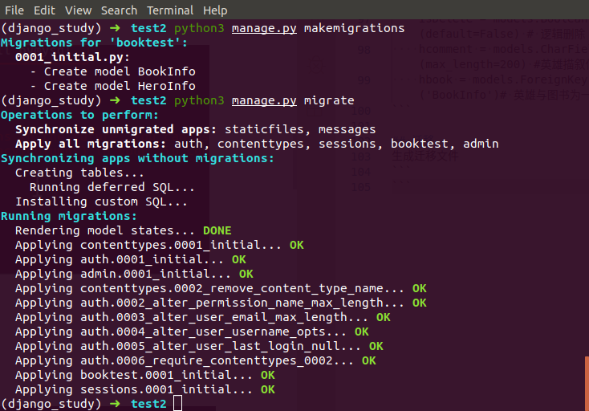
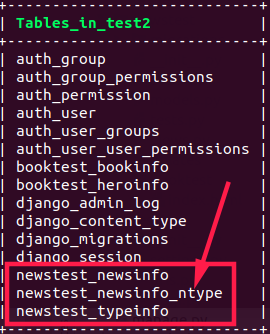

<!-- TOC -->

- [创建项目](#创建项目)
  - [创建项目](#创建项目-1)
  - [修改数据库](#修改数据库)
  - [创建应用](#创建应用)
- [定义模型类](#定义模型类)
  - [定义模型类](#定义模型类-1)
  - [迁移](#迁移)
  - [测试数据](#测试数据)
  - [定义视图](#定义视图)
  - [配置url](#配置url)
  - [创建模板](#创建模板)
  - [运行](#运行)
- [定义属性](#定义属性)
  - [字段类型](#字段类型)
  - [选项](#选项)
  - [综合演示](#综合演示)
  - [字段查询](#字段查询)
  - [条件运算符](#条件运算符)
    - [exact：表示判等](#exact表示判等)
    - [模糊查询](#模糊查询)
  - [F对象](#f对象)
  - [Q对象](#q对象)
  - [聚合函数](#聚合函数)
  - [查询集](#查询集)
    - [返回查询集的过滤器如下：](#返回查询集的过滤器如下)
    - [返回单个值的过滤器如下：](#返回单个值的过滤器如下)
    - [判断某一个查询集中是否有数据：](#判断某一个查询集中是否有数据)
    - [两大特性](#两大特性)
    - [限制查询集](#限制查询集)
- [模型关系](#模型关系)
  - [关系字段类型](#关系字段类型)
    - [多对多关系](#多对多关系)
  - [关联查询](#关联查询)
    - [过对象执行关联查询](#过对象执行关联查询)
    - [通过模型类执行关联查询](#通过模型类执行关联查询)
  - [自关联](#自关联)
  - [模型实例方法](#模型实例方法)
  - [模型类的属性](#模型类的属性)
    - [管理器Manager](#管理器manager)
      - [1.修改原始查询集，重写all()方法。](#1修改原始查询集重写all方法)
      - [2.在管理器类中定义创建对象的方法](#2在管理器类中定义创建对象的方法)
  - [元选项](#元选项)

<!-- /TOC -->

# 创建项目
## 创建项目
进入虚拟环境中，创建项目 test2
```
django-admin startproject test2
```


## 修改数据库
打开 `test2/settings.py` 文件，找到 DATABASES 项，默认使用 SQLite3 数据库。
```
DATABASES = {
    'default': {
        'ENGINE': 'django.db.backends.sqlite3',
        'NAME': os.path.join(BASE_DIR, 'db.sqlite3'),
    }
}
```
修改为使用 MySQL 数据库，代码如下
```
DATABASES = {
    'default': {
        # 'ENGINE': 'django.db.backends.sqlite3',
        # 'NAME': os.path.join(BASE_DIR, 'db.sqlite3'),
        'ENGINE': 'django.db.backends.mysql', # 引擎
        'NAME' : 'test2', # 数据库名称
        'USER' : 'ckcat', # 数据库登录用户名
        'PASSWORD' : 'mysql', # 数据库登录密码
        'HOST' : 'localhost', #数据库所在主机
        'PORT' : '3306',  #数据库端口
    }
}
```
> 注意：数据库test2 Django框架不会自动生成，需要我们自己进入mysql数据库去创建。

创建 test2 数据库
```
create database test2 charset=utf8;
```

## 创建应用
创建应用 booktest .
```
python manage.py startapp booktest
```
此时可能会出现一下错误。


此时需要安装 `pip install pymysql` ，安装成功后在 `test2/__init__.py` 文件中加上如下代码：
```
import pymysql
pymysql.install_as_MySQLdb()
```
然后再执行创建 booktest 应用的命令。

将应用 booktest 注册到项目中，打开 `/test2/settings.py` 文件，找到 INSTALLED_APPS 项，加入如下代码：
```
INSTALLED_APPS = (
    'django.contrib.admin',
    'django.contrib.auth',
    'django.contrib.contenttypes',
    'django.contrib.sessions',
    'django.contrib.messages',
    'django.contrib.staticfiles',
    'booktest', # 注册应用
)
```

# 定义模型类
## 定义模型类
打开 booktest/models.py 文件，定义模型类如下
```
from django.db import models

# Create your models here.

# 定义图书模型类 BookInfo
class BookInfo(models.Model):
    btitle = models.CharField(max_length=20) # 图书名称
    bpub_date = models.DateField() # 发布日期
    bread = models.IntegerField(default=0) # 阅读量
    bcomment = models.IntegerField(default=0) # 评论量
    isDelete = models.BooleanField(default=False) # 逻辑删除

# 定义英雄模型类 HeroInfo
class HeroInfo(models.Model):
    hname = models.CharField(max_length=20) #英雄名称
    hgender = models.BooleanField(default=True) #英雄性别
    isDelete = models.BooleanField(default=False) # 逻辑删除
    hcomment = models.CharField(max_length=200) #英雄描叙信息
    hbook = models.ForeignKey('BookInfo')# 英雄与图书为一对多关系
```

## 迁移
生成迁移文件
```
python manage.py makemigrations
python manage.py migrate
```


打开数据库命令行，查看当前所有表


表 bookinfo 结构如下
> 默认值并不在数据库层面生效，而是在django创建对象时生效。


表 heroinfo 结构如下：
> Django框架会根据关系属性生成一个关系字段，并创建外键约束。


## 测试数据
在数据库命令行中，复制如下语句执行，向booktest_bookinfo表中插入测试数据：
```
insert into booktest_bookinfo(btitle,bpub_date,bread,bcomment,isDelete) values
('射雕英雄传','1980-5-1',12,34,0),
('天龙八部','1986-7-24',36,40,0),
('笑傲江湖','1995-12-24',20,80,0),
('雪山飞狐','1987-11-11',58,24,0);
```
再复制如下语句执行，向booktest_heroinfo表中插入测试数据：
```
insert into booktest_heroinfo(hname,hgender,hbook_id,hcomment,isDelete) values
('郭靖',1,1,'降龙十八掌',0),
('黄蓉',0,1,'打狗棍法',0),
('黄药师',1,1,'弹指神通',0),
('欧阳锋',1,1,'蛤蟆功',0),
('梅超风',0,1,'九阴白骨爪',0),
('乔峰',1,2,'降龙十八掌',0),
('段誉',1,2,'六脉神剑',0),
('虚竹',1,2,'天山六阳掌',0),
('王语嫣',0,2,'神仙姐姐',0),
('令狐冲',1,3,'独孤九剑',0),
('任盈盈',0,3,'弹琴',0),
('岳不群',1,3,'华山剑法',0),
('东方不败',0,3,'葵花宝典',0),
('胡斐',1,4,'胡家刀法',0),
('苗若兰',0,4,'黄衣',0),
('程灵素',0,4,'医术',0),
('袁紫衣',0,4,'六合拳',0);
```

## 定义视图
打开booktest/views.py文件，定义视图代码如下：
```
from django.shortcuts import render,redirect
from booktest.models import *
from datetime import date

#查询所有图书并显示
def index(request):
    list=BookInfo.objects.all()
    return render(request,'booktest/index.html',{'list':list})

#创建新图书
def create(request):
    book=BookInfo()
    book.btitle = '流星蝴蝶剑'
    book.bpub_date = date(1995,12,30)
    book.save()
    #转向到首页
    return redirect('/')

#逻辑删除指定编号的图书
def delete(request,id):
    book=BookInfo.objects.get(id=int(id))
    book.delete()
    #转向到首页
    return redirect('/')
```

## 配置url

打开test2/urls.py文件，配置url如下：
```
from django.conf.urls import include, url
from django.contrib import admin

urlpatterns = [
    url(r'^admin/', include(admin.site.urls)),
    #引入booktest的url配置
    url(r'^',include('booktest.urls')),
]
```
在booktest应用下创建urls.py文件，代码如下：
```
from django.conf.urls import url
from booktest import views

urlpatterns=[
    url(r'^$',views.index),
    url(r'^delete(\d+)/$',views.delete),
    url(r'^create/$',views.create),
]
```

## 创建模板
打开 test2/settings.py` 文件，配置模板查找目录 TEMPLATES 的 DIRS 。
```
TEMPLATES = [
    {
        'BACKEND': 'django.template.backends.django.DjangoTemplates',
        'DIRS': [os.path.join(BASE_DIR, "templates")],#配置模板查找目录
        'APP_DIRS': True,
        'OPTIONS': {
            'context_processors': [
                'django.template.context_processors.debug',
                'django.template.context_processors.request',
                'django.contrib.auth.context_processors.auth',
                'django.contrib.messages.context_processors.messages',
            ],
        },
    },
]
```
创建 `templates/booktest/index.html` 文件, 模板代码如下
```
<!DOCTYPE html>
<html lang="en">
<head>
    <meta charset="UTF-8">
    <title>Title</title>
</head>
<body>

<a href="/create/">创建</a>

<ul>
    
        <li>{{ book.btitle }} -- <a href="/delete{{ book.id }}/">删除</a> </li>
    
</ul>

</body>
</html>
```
## 运行
运行服务器，在浏览器中查看。
```
python manage.py runserver
```

# 定义属性

django会为表创建自动增长的主键列，每个模型只能有一个主键列，如果使用选项设置某属性为主键列后django不会再创建自动增长的主键列。

属性命名限制：
* 不能是python的保留关键字。
* 不允许使用连续的下划线，这是由django的查询方式决定的，在后面会详细讲解查询。
* 定义属性时需要指定字段类型，通过字段类型的参数指定选项，语法如下：
```
属性 = models.字段类型(选项)
```

## 字段类型

使用时需要引入django.db.models包，字段类型如下：

* `AutoField`：自动增长的 IntegerField ，通常不用指定，不指定时Django会自动创建属性名为 id 的自动增长属性。
* `BooleanField`：布尔字段，值为 True 或 False 。
* `NullBooleanField`：支持 Null 、 True 、 False 三种值。
* `CharField(max_length=字符长度)`：字符串。
    * 参数 max_length 表示最大字符个数。
* `TextField` ：大文本字段，一般超过4000个字符时使用。
* `IntegerField` ：整数。
* `DecimalField(max_digits=None, decimal_places=None)` ：十进制浮点数。
    * 参数 max_digits 表示总位数。
    * 参数 decimal_places 表示小数位数。
* `FloatField` ：浮点数。
* `DateField[auto_now=False, auto_now_add=False])` ：日期。
    * 参数 auto_now 表示每次保存对象时，自动设置该字段为当前时间，用于"最后一次修改"的时间戳，它总是使用当前日期，默认为 false 。
    * 参数 auto_now_add 表示当对象第一次被创建时自动设置当前时间，用于创建的时间戳，它总是使用当前日期，默认为 false 。
    * 参数 auto_now_add 和 auto_now 是相互排斥的，组合将会发生错误。
* `TimeField`：时间，参数同 DateField 。
* `DateTimeField`：日期时间，参数同 DateField 。
* `FileField`：上传文件字段。
* `ImageField`：继承于 FileField ，对上传的内容进行校验，确保是有效的图片。

## 选项

通过选项实现对字段的约束，选项如下：

* `null` ：如果为 True ，表示允许为空，默认值是 False 。
* `blank`：如果为 True ，则该字段允许为空白，默认值是 False 。
* **对比：null是数据库范畴的概念，blank是表单验证范畴的。**
* `db_column` ：字段的名称，如果未指定，则使用属性的名称。
* `db_index` ：若值为 True , 则在表中会为此字段创建索引，默认值是 False 。
* `default` ：默认值。
* `primary_key` ：若为 True ，则该字段会成为模型的主键字段，默认值是 False ，一般作为 AutoField 的选项使用。
* `unique`：如果为 True , 这个字段在表中必须有唯一值，默认值是 False 。

## 综合演示
修改 `booktest/models.py` 中模型类，代码如下：
```
# 定义图书模型类 BookInfo
class BookInfo(models.Model):
    # btitle = models.CharField(max_length=20) # 图书名称
    btitle = models.CharField(max_length=20, db_column='title') # 通过db_column指定btitle对应表格中字段的名字为title
    bpub_date = models.DateField() # 发布日期
    bread = models.IntegerField(default=0) # 阅读量
    bcomment = models.IntegerField(default=0) # 评论量
    isDelete = models.BooleanField(default=False) # 逻辑删除

# 定义英雄模型类 HeroInfo
class HeroInfo(models.Model):
    hname = models.CharField(max_length=20) #英雄名称
    hgender = models.BooleanField(default=True) #英雄性别
    isDelete = models.BooleanField(default=False) # 逻辑删除
    # hcomment = models.CharField(max_length=200) #英雄描叙信息
    # hcomment对应的数据库中的字段可以为空，但通过后台管理页面添加英雄信息时hcomment对应的输入框不能为空
    hcomment = models.CharField(max_length=200, null=True, blank=False)
    hbook = models.ForeignKey('BookInfo')# 英雄与图书为一对多关系
```
然后生成迁移文件并执行迁移命令，最后查看test2数据库中的内容。

## 字段查询
实现 sql 中 where 的功能，调用过滤器 filter() 、 exclude() 、 get() ，下面以 filter() 为例。

语法如下：
> 说明：属性名称和比较运算符间使用两个下划线，所以属性名不能包括多个下划线。

```
属性名称__比较运算符=值
```

## 条件运算符
### exact：表示判等
例: 查询没有被删除的图书

```
# 查询没有被逻辑删除的图书,下列两种方式都可以
#bklist = BookInfo.objects.filter(isDelete__exact= 0)
bklist = BookInfo.objects.filter(isDelete = 0)
```

### 模糊查询

**contains：是否包含。**

> 说明：如果要包含%无需转义，直接写即可。

例：查询书名包含'传'的图书。
```
bklist = BookInfo.objects.filter(btitle__contains = "传")
```

**startswith、endswith：以指定值开头或结尾。**

例：查询书名以'部'结尾的图书

```
bklist = BookInfo.objects.filter(btitle__endswith =  "部")
```

**空查询 isnull : 是否为 null 。**

例：查询书名不为空的图书。

```
bklist = BookInfo.objects.filter(btitle__isnull=False)
```

**范围查询 in ：是否包含在范围内。**

例：查询编号为1或3或5的图书

```
bklist = BookInfo.objects.filter(id__in=[1, 3, 5])
```

**比较查询**

> gt、gte、lt、lte：大于、大于等于、小于、小于等于。

例：查询编号大于3的图书

```
bklist = BookInfo.objects.filter(id__gt = 3)
```

**不等于的运算符，使用 `exclude()` 过滤器。**

例：查询编号不等于3的图书

```
bklist = BookInfo.objects.exclude(id=3)
```

**日期查询**

> year、month、day、week_day、hour、minute、second：对日期时间类型的属性进行运算。

例：查询1980年发表的图书。

```
bklist = BookInfo.objects.filter(bpub_date__year=1980)
```

例：查询1980年1月1日后发表的图书。

```
bklist = BookInfo.objects.filter(bpub_date__gt=date(1990, 1, 1))
```

## F对象
之前的查询都是对象的属性与常量值比较，两个属性怎么比较呢？ 答：使用F对象，被定义在django.db.models中。

语法如下：

```
F(属性名)
```

例：查询阅读量大于等于评论量的图书。

```
from django.db.models import F
...
bklist = BookInfo.objects.filter(bread__gte=F('bcomment'))
````

可以在F对象上使用算数运算。

例：查询阅读量大于2倍评论量的图书。

```
bklist = BookInfo.objects.filter(bread__gt=F('bcomment')*2)
```

## Q对象

多个过滤器逐个调用表示逻辑与关系，同sql语句中where部分的and关键字。

例：查询阅读量大于20，并且编号小于3的图书。

```
bklist=BookInfo.objects.filter(bread__gt=20,id__lt=3)
或
bklist=BookInfo.objects.filter(bread__gt=20).filter(id__lt=3)
```

如果需要实现逻辑或or的查询，需要使用Q()对象结合|运算符，Q对象被义在 django.db.models 中。

语法如下：

```
Q(属性名__运算符=值)
```

例：查询阅读量大于20的图书，改写为Q对象如下。
```
from django.db.models import Q
...
bklist = BookInfo.objects.filter(Q(bread__gt=20))
```

Q对象可以使用&、|连接，&表示逻辑与，|表示逻辑或。

例：查询阅读量大于20，或编号小于3的图书，只能使用Q对象实现
```
bklist = BookInfo.objects.filter(Q(bread__gt=20) | Q(id__lt=3))
```

Q对象前可以使用~操作符，表示非not。

例：查询编号不等于3的图书。
```
bklist = BookInfo.objects.filter(~Q(pk=3))
```

## 聚合函数
使用 `aggregate()` 过滤器调用聚合函数。聚合函数包括：Avg，Count，Max，Min，Sum，被定义在django.db.models中。

例：查询图书的总阅读量。
```
from django.db.models import Sum
...
list = BookInfo.objects.aggregate(Sum('bread'))
```
注意aggregate的返回值是一个字典类型，格式如下：
```
{'聚合类小写__属性名':值}
如:{'sum__bread':3}
```


使用count时一般不使用aggregate()过滤器。

例：查询图书总数。
```
list = BookInfo.objects.count()
```
注意count函数的返回值是一个数字。

## 查询集
查询集表示从数据库中获取的对象集合，在管理器上调用某些过滤器方法会返回查询集，查询集可以含有零个、一个或多个过滤器。过滤器基于所给的参数限制查询的结果，从Sql的角度，查询集和select语句等价，过滤器像where和limit子句。

### 返回查询集的过滤器如下：
* `all()` ：返回所有数据。
* `filter()` ：返回满足条件的数据。
* `exclude()` ：返回满足条件之外的数据，相当于 sql 语句中 where 部分的 not 关键字。
* `order_by()` ：对结果进行排序。

### 返回单个值的过滤器如下：
* `get()` ：返回单个满足条件的对象
    * 如果未找到会引发"模型类 .DoesNotExist "异常。
    * 如果多条被返回，会引发"模型类 .MultipleObjectsReturned "异常。
* `count()`：返回当前查询结果的总条数。
* `aggregate()`：聚合，返回一个字典。

### 判断某一个查询集中是否有数据：

* `exists()`：判断查询集中是否有数据，如果有则返回 True ，没有则返回 False 。

### 两大特性

* 惰性执行：创建查询集不会访问数据库，直到调用数据时，才会访问数据库，调用数据的情况包括迭代、序列化、与if合用。
* 缓存：使用同一个查询集，第一次使用时会发生数据库的查询，然后把结果缓存下来，再次使用这个查询集时会使用缓存的数据。

**查询集的缓存**

每个查询集都包含一个缓存来最小化对数据库的访问。

在新建的查询集中，缓存为空，首次对查询集求值时，会发生数据库查询，django会将查询的结果存在查询集的缓存中，并返回请求的结果，接下来对查询集求值将重用缓存中的结果。

演示：运行项目shell。
```
python manage.py shell
```
**情况一**：如下是两个查询集，无法重用缓存，每次查询都会与数据库进行一次交互，增加了数据库的负载。
```
from booktest.models import BookInfo
[book.id for book in BookInfo.objects.all()]
[book.id for book in BookInfo.objects.all()]
```
**情况二**：经过存储后，可以重用查询集，第二次使用缓存中的数据。
```
list=BookInfo.objects.all()
[book.id for book in list]
[book.id for book in list]
```

### 限制查询集
可以对查询集进行取下标或切片操作，等同于 sql 中的 limit 和 offset 子句。
> 注意：不支持负数索引。

对查询集进行切片后返回一个新的查询集，不会立即执行查询。

如果获取一个对象，直接使用 [0] ，等同于 [0:1].get() ，但是如果没有数据，[0]引发 IndexError 异常， [0:1].get() 如果没有数据引发 DoesNotExist 异常。

示例：获取第1、2项，运行查看。
```
list=BookInfo.objects.all()[0:2]
```

# 模型关系

## 关系字段类型

关系型数据库的关系包括三种类型：

* ForeignKey：一对多，将字段定义在多的一端中。
* ManyToManyField：多对多，将字段定义在任意一端中。
* OneToOneField：一对一，将字段定义在任意一端中。
* 可以维护递归的关联关系，使用'self'指定，详见"自关联"。

### 多对多关系
重新在项目 test2 下新建一个应用 newstest ,注册应用之后，编辑 `newstest/models.py` 文件设计模型类。
```
from django.db import models
# Create your models here.
class TypeInfo(models.Model):
    tname = models.CharField(max_length=20) #新闻类型

class NewsInfo(models.Model):
    ntitle = models.CharField(max_length=60) # 新闻标题
    ncontent = models.TextField() # 新闻内容
    npub_date = models.DateTimeField(auto_now_add=True) #新闻发布时间
    ntype = models.ManyToManyField('TypeInfo') #通过ManyToManyField建立TypeInfo类和NewsInfo类之间多对多的关系
    
```
生成迁移文件后，可以发现 newstest 多了一个 newstest_newsinfo_ntype 的中间表。


## 关联查询

### 过对象执行关联查询

在定义模型类时，可以指定三种关联关系，最常用的是一对多关系，如本例中的"图书-英雄"就为一对多关系，接下来进入shell练习关系的查询。

由一到多的访问语法：
```
一对应的模型类对象.多对应的模型类名小写_set
例：
b = BookInfo.objects.get(id=1)
b.heroinfo_set.all()
```
由多到一的访问语法:
```
多对应的模型类对象.多对应的模型类中的关系类属性名
例：
h = HeroInfo.objects.get(id=1)
h.hbook
```

访问一对应的模型类关联对象的id语法:
```
多对应的模型类对象.关联类属性_id
例：
h = HeroInfo.objects.get(id=1)
h.hbook_id
```


### 通过模型类执行关联查询

由多模型类条件查询一模型类数据:

语法如下：
```
关联模型类名小写__属性名__条件运算符=值
```
> 如果没有"__运算符"部分，表示等于，结果和sql中的inner join相同。

例：查询图书，要求图书中英雄的描述包含'八'。
```
bklist = BookInfo.objects.filter(heroinfo__hcomment__contains='八')
```
由一模型类条件查询多模型类数据: 语法如下：
```
一模型类关联属性名__一模型类属性名__条件运算符=值
```
例：查询书名为“天龙八部”的所有英雄。
```
hlist = HeroInfo.objects.filter(hbook__btitle="天龙八部")
```


## 自关联

对于地区信息、分类信息等数据，表结构非常类似，每个表的数据量十分有限，为了充分利用数据表的大量数据存储功能，可以设计成一张表，内部的关系字段指向本表的主键，这就是自关联的表结构。

打开booktest/models.py文件，定义AreaInfo类。

> 说明：关系属性使用self指向本类，要求null和blank允许为空，因为一级数据是没有父级的。
```
#定义地区模型类，存储省、市、区县信息
class AreaInfo(models.Model):
    atitle=models.CharField(max_length=30)#名称
    aParent=models.ForeignKey('self',null=True,blank=True)#关系
```
迁移。
```
python manage.py makemigrations
python manage.py migrate
```
打开mysql命令行，导入数据。
```
source area.sql
```
打开booktest/views.py文件，定义视图area。
```
from booktest.models import AreaInfo
...
#查询广州市的信息
def area(request):
    area = AreaInfo.objects.get(pk=440100)
    return render(request, 'booktest/area.html', {'area': area})

打开booktest/urls.py文件，新建一条url。

urlpatterns = [
    ...
    url(r'^area/$', views.area),
]
```
在templates/booktest目录下，新建area.html文件。
```
<html>
<head>
    <title>地区</title>
</head>
<body>
当前地区：{{area.atitle}}
<hr/>
上级地区：{{area.aParent.atitle}}
<hr/>
下级地区：
<ul>
    
    <li>{{a.atitle}}</li>
    
</ul>
</body>
</html>
```
运行服务器。
```
python manage.py runserver
```
在浏览器中输出效果如下图。


## 模型实例方法


* str()：在将对象转换成字符串时会被调用。
* save()：将模型对象保存到数据表中，ORM框架会转换成对应的insert或update语句。
* delete()：将模型对象从数据表中删除，ORM框架会转换成对应的delete语句。

## 模型类的属性
属性objects：管理器，是models.Manager类型的对象，用于与数据库进行交互。

> 当没有为模型类定义管理器时，Django会为每一个模型类生成一个名为objects的管理器，自定义管理器后，Django不再生成默认管理器objects。

为模型类BookInfo定义管理器books语法如下：
```
class BookInfo(models.Model):
    ...
    books = models.Manager()
```

### 管理器Manager

管理器是Django的模型进行数据库操作的接口，Django应用的每个模型类都拥有至少一个管理器。Django支持自定义管理器类，继承自models.Manager。

自定义管理器类主要用于两种情况：
#### 1.修改原始查询集，重写all()方法。

a）打开 `booktest/models.py` 文件，定义类BookInfoManager
```
#图书管理器
class BookInfoManager(models.Manager):
    def all(self):
        #默认查询未删除的图书信息
        #调用父类的成员语法为：super().方法名
        return super().all().filter(isDelete=False)
```

b）在模型类BookInfo中定义管理器
```
class BookInfo(models.Model):
    ...
    books = BookInfoManager()
```

#### 2.在管理器类中定义创建对象的方法

对模型类对应的数据表进行操作时，推荐将这些操作数据表的方法封装起来，放到模型管理器类中。

a）打开 `booktest/models.py` 文件，定义方法create。
```
class BookInfoManager(models.Manager):
    ...
    #创建模型类，接收参数为属性赋值
    def create_book(self, title, pub_date):
        #创建模型类对象self.model可以获得模型类
        book = self.model()
        book.btitle = title
        book.bpub_date = pub_date
        book.bread=0
        book.bcommet=0
        book.isDelete = False
        # 将数据插入进数据表
        book.save()
        return book
```

b）为模型类BookInfo定义管理器books语法如下
```
class BookInfo(models.Model):
    ...
    books = BookInfoManager()
```

c）调用语法如下：
```
调用：book=BookInfo.books.create_book("abc",date(1980,1,1))
```

## 元选项

在模型类中定义类Meta，用于设置元信息，如使用db_table自定义表的名字。

数据表的默认名称为：
```
<app_name>_<model_name>
```

例：
booktest_bookinfo

例：指定 BookInfo 模型类生成的数据表名为 bookinfo 。

在 BookInfo 模型类中添加如下内容，代码如下：
```
#定义图书模型类BookInfo
class BookInfo(models.Model):
    ...

    #定义元选项
    class Meta:
      db_table='bookinfo' #指定BookInfo生成的数据表名为bookinfo
```
