# 富文本编辑器

借助富文本编辑器，网站的编辑人员能够像使用offfice一样编写出漂亮的、所见即所得的页面。此处以tinymce为例，其它富文本编辑器的使用也是类似的。

在虚拟环境中安装包。
```
pip install django-tinymce==2.6.0
```
安装完成后，可以使用在Admin管理中，也可以自定义表单使用。

## 示例

1）在 `test6/settings.py` 中为 INSTALLED_APPS 添加编辑器应用。
```
INSTALLED_APPS = (
    ...
    'tinymce',
)
```
2）在 `test6/settings.py` 中添加编辑器配置。
```
TINYMCE_DEFAULT_CONFIG = {
    'theme': 'advanced',
    'width': 600,
    'height': 400,
}
```
3）在 `test6/urls.py` 中配置编辑器 url。

urlpatterns = [
    ...
    url(r'^tinymce/', include('tinymce.urls')),
]

接下来介绍在 Admin 页面、自定义表单页面的使用方式。


### 在Admin中使用

1）在 `booktest/models.py` 中，定义模型的属性为 `HTMLField()` 类型。
```
from django.db import models
from tinymce.models import HTMLField

class GoodsInfo(models.Model):
    gcontent=HTMLField()
```

2）生成迁移文件。
```
python manage.py makemigrations
python manage.py migrate
```

4）在本示例中没有定义其它的模型类，但是数据库中有这些表，提示是否删除，输入no后回车，表示不删除，因为其它的示例中需要使用这些表。

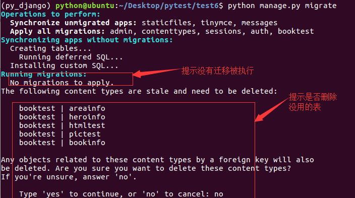

5）迁移完成，新开终端，连接 mysql ，使用 test2 数据库，查看表如下：


6）发现并没有表 GoodsInfo ，解决办法是删除迁移表中关于 booktest 应用的数据。
```
delete from django_migrations where app='booktest';
```
7）再次执行迁移。
```
python manage.py migrate
```
成功完成迁移，记得不删除no。

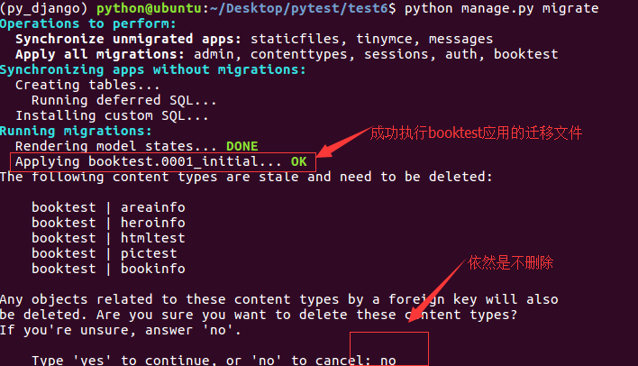

8）在 `booktest/admin.py` 中注册模型类 GoodsInfo 
```
from django.contrib import admin
from booktest.models import *
class GoodsInfoAdmin(admin.ModelAdmin):
    list_display = ['id']

admin.site.register(GoodsInfo,GoodsInfoAdmin)
```
9）运行服务器，进入 admin 后台管理，点击 GoodsInfo 的添加，效果如下图

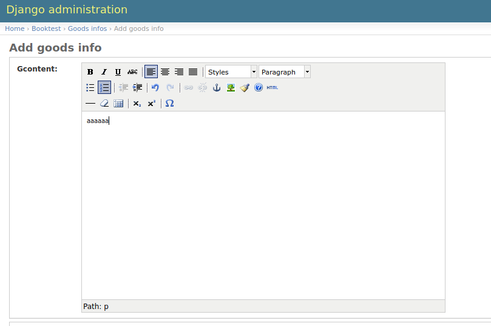

在编辑器中编辑内容后保存。

### 自定义使用

1）在 `booktest/views.py` 中定义视图 editor ，用于显示编辑器。
```
def editor(request):
    return render(request, 'booktest/editor.html')
```
2）在 `booktest/urls.py` 中配置 url 。
```
    url(r'^editor/',views.editor),
```
3）在项目目录下创建静态文件目录如下图：


4）打开py_django虚拟环境的目录，找到tinymce的目录。
```
.virtualenvs/py_django/lib/python3.5/site-packages/tinymce/static/tiny_mce
```
5）拷贝 `tiny_mce_src.js` 文件、langs文件夹以及themes文件夹拷贝到项目目录下的 `static/js/` 目录下。

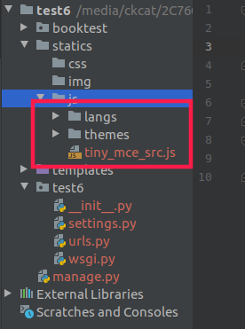

6）在 `test6/settings.py` 中配置静态文件查找路径。
```
STATICFILES_DIRS=[
    os.path.join(BASE_DIR,'statics'),
]
```
7）在 `templates/booktest/` 目录下创建 `editor.html` 模板。
```
<html>
<head>
    <title>自定义使用tinymce</title>
    <script type="text/javascript" src='/statics/js/tiny_mce_src.js'></script>
    <script type="text/javascript">
        tinyMCE.init({
            'mode':'textareas',
            'theme':'advanced',
            'width':400,
            'height':100
        });
    </script>
</head>
<body>
<form method="post" action="#">
    <textarea name='gcontent'>哈哈，这是啥呀</textarea>
</form>
</body>
</html>
```
8）运行服务器，在浏览器中输入如下网址：

http://127.0.0.1:8000/editor/

浏览效果如下图：

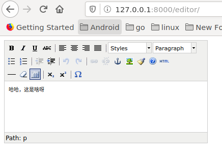

### 显示
通过富文本编辑器产生的字符串是包含html的。 在数据库中查询如下图：


在模板中显示字符串时，默认会进行html转义，如果想正常显示需要关闭转义。

问：在模板中怎么关闭转义

* 方式一：过滤器safe
* 方式二：标签autoescape off

1）在 `booktest/views.py` 中定义视图 show，用于显示富文本编辑器的内容。
```
from booktest.models import *
...
def show(request):
    goods=GoodsInfo.objects.get(pk=1)
    context={'g':goods}
    return render(request,'booktest/show.html',context)
```

2）在 `booktest/urls.py` 中配置url。
```
url(r'^show/', views.show),
```
3）在 `templates/booktest/` 目录下创建 `show.html` 模板。
```
<html>
<head>
    <title>展示富文本编辑器内容</title>
</head>
<body>
id:{{g.id}}
<hr>

{{g.gcontent}}

<hr>
{{g.gcontent|safe}}
</body>
</html>
```
4）运行服务器，在浏览器中输入如下网址：
```
http://127.0.0.1:8000/show/
```
浏览效果如下图：

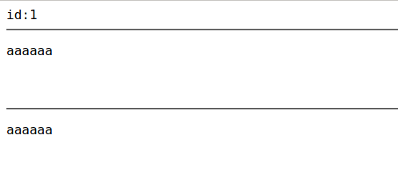


# 全文检索

全文检索不同于特定字段的模糊查询，使用全文检索的效率更高，并且能够对于中文进行分词处理。

haystack：全文检索的框架，支持whoosh、solr、Xapian、Elasticsearc四种全文检索引擎，点击查看[官方网站](http://haystacksearch.org/)。
whoosh：纯Python编写的全文搜索引擎，虽然性能比不上sphinx、xapian、Elasticsearc等，但是无二进制包，程序不会莫名其妙的崩溃，对于小型的站点，whoosh已经足够使用，点击查看[whoosh文档](https://whoosh.readthedocs.io/en/latest/)。
jieba：一款免费的中文分词包，如果觉得不好用可以使用一些收费产品。

1）在虚拟环境中依次安装需要的包。
```
pip install django-haystack
pip install whoosh
pip install jieba
```
2）修改 `test6/settings.py` 文件，安装应用 haystack 。
```
INSTALLED_APPS = (
    ...
    'haystack',
)
```

3）在 `test6/settings.py` 文件中配置搜索引擎。
```
...
HAYSTACK_CONNECTIONS = {
    'default': {
        #使用whoosh引擎
        'ENGINE': 'haystack.backends.whoosh_cn_backend.WhooshEngine',
        #索引文件路径
        'PATH': os.path.join(BASE_DIR, 'whoosh_index'),
    }
}

#当添加、修改、删除数据时，自动生成索引
HAYSTACK_SIGNAL_PROCESSOR = 'haystack.signals.RealtimeSignalProcessor'
```
4）在 `test6/urls.py` 中添加搜索的配置。
```
    url(r'^search/', include('haystack.urls')),
```

## 创建引擎及索引

1）在 booktest 目录下创建 `search_indexes.py` 文件。
```
from haystack import indexes
from booktest.models import GoodsInfo
#指定对于某个类的某些数据建立索引
class GoodsInfoIndex(indexes.SearchIndex, indexes.Indexable):
    text = indexes.CharField(document=True, use_template=True)

    def get_model(self):
        return GoodsInfo

    def index_queryset(self, using=None):
        return self.get_model().objects.all()
```
2）在 templates 目录下创建 `search/indexes/booktest/` 目录, 并在该目录中创建 `goodsinfo_text.txt` 文件。
```
#指定索引的属性
{{object.gcontent}}
```
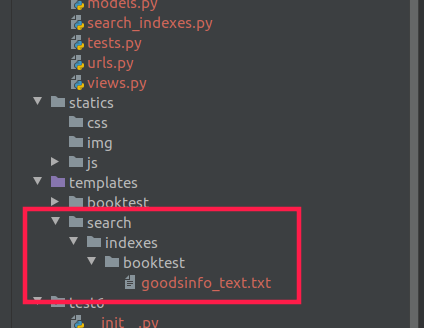

4）找到虚拟环境 py_django 下的 haystack 目录。
```
.virtualenvs/py_django/lib/python3.5/site-packages/haystack/backends/
```
5）在上面的目录中创建 `ChineseAnalyzer.py` 文件。
```
import jieba
from whoosh.analysis import Tokenizer, Token

class ChineseTokenizer(Tokenizer):
    def __call__(self, value, positions=False, chars=False,
                 keeporiginal=False, removestops=True,
                 start_pos=0, start_char=0, mode='', **kwargs):
        t = Token(positions, chars, removestops=removestops, mode=mode,
                  **kwargs)
        seglist = jieba.cut(value, cut_all=True)
        for w in seglist:
            t.original = t.text = w
            t.boost = 1.0
            if positions:
                t.pos = start_pos + value.find(w)
            if chars:
                t.startchar = start_char + value.find(w)
                t.endchar = start_char + value.find(w) + len(w)
            yield t

def ChineseAnalyzer():
    return ChineseTokenizer()
```
6）复制 `whoosh_backend.py` 文件，改为 `whoosh_cn_backend.py` 名称：

7）打开复制出来的新文件，引入中文分析类，内部采用jieba分词。
```
from .ChineseAnalyzer import ChineseAnalyzer
```
8）更改词语分析类。
```
查找
analyzer=StemmingAnalyzer()
改为
analyzer=ChineseAnalyzer()
```

9）初始化索引数据。
```
python manage.py rebuild_index
```
10）按提示输入y后回车，生成索引。


11）索引生成后目录结构如下图：

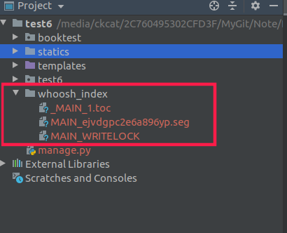


## 使用

按照配置，在admin管理中添加数据后，会自动为数据创建索引，可以直接进行搜索，可以先创建一些测试数据。

1）在 `booktest/views.py` 中定义视图 query 。
```
def query(request):
    return render(request,'booktest/query.html')
```
2）在 `booktest/urls.py` 中配置。
```
    url(r'^query/', views.query),
```
3）在 `templates/booktest/` 目录中创建模板 `query.html` 。

> 参数q表示搜索内容，传递到模板中的数据为query。
```
<html>
<head>
    <title>全文检索</title>
</head>
<body>
<form method='get' action="/search/" target="_blank">
    <input type="text" name="q">
    <br>
    <input type="submit" value="查询">
</form>
</body>
</html>
```
4）自定义搜索结果模板：在templates/search/目录下创建search.html。

搜索结果进行分页，视图向模板中传递的上下文如下：

* query：搜索关键字
* page：当前页的page对象
* paginator：分页paginator对象

视图接收的参数如下：

* 参数q表示搜索内容，传递到模板中的数据为query
* 参数page表示当前页码
```
<html>
<head>
    <title>全文检索--结果页</title>
</head>
<body>
<h1>搜索&nbsp;<b>{{query}}</b>&nbsp;结果如下：</h1>
<ul>

    <li>{{item.object.id}}--{{item.object.gcontent|safe}}</li>

    <li>啥也没找到</li>

</ul>
<hr>

    
        {{pindex}}&nbsp;&nbsp;
    
        <a href="?q={{query}}&amp;page={{pindex}}">{{pindex}}</a>&nbsp;&nbsp;
    

</body>
</html>
```
5）运行服务器，在浏览器中输入如下地址：
```
http://127.0.0.1:8000/query/
```
在文本框中填写要搜索的信息，点击”搜索“按钮。

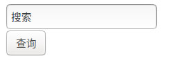

搜索结果如下：

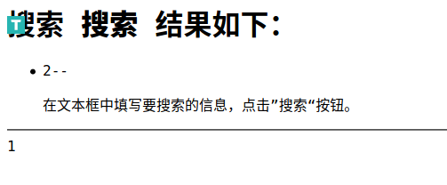

# 发送邮件

Django中内置了邮件发送功能，被定义在django.core.mail模块中。发送邮件需要使用SMTP服务器，常用的免费服务器有：163、126、QQ，下面以163邮件为例。

1）注册163邮箱，登录后设置。


2）在新页面中点击“客户端授权密码”，开启授权码。


3）打开 `test6/settings.py`文件，点击下图配置。
```
EMAIL_BACKEND = 'django.core.mail.backends.smtp.EmailBackend'
EMAIL_HOST = 'smtp.163.com'
EMAIL_PORT = 25
#发送邮件的邮箱
EMAIL_HOST_USER = 'xxx@163.com'
#在邮箱中设置的客户端授权密码
EMAIL_HOST_PASSWORD = 'xxx'
#收件人看到的发件人
EMAIL_FROM = 'python<xxx@163.com>'
```
6）在 `booktest/views.py` 文件中新建视图 send。
```
from django.conf import settings
from django.core.mail import send_mail
from django.http import HttpResponse
...
def send(request):
    msg = msg='<a href="https://ckcat.github.io/" target="_blank">点击激活</a>'
    send_mail('注册激活', '', settings.EMAIL_FROM,
              ['ckcatck@qq.com'],
              html_message=msg)
    return HttpResponse("OK")

```
7）在 `booktest/urls.py` 文件中配置。
```
    url(r'^send/$',views.send),
```
8）启动服务器，在浏览器中输入如下网址：
```
http://127.0.0.1:8000/send/
```
邮件发送成功后，在邮箱中查看邮件如下图：

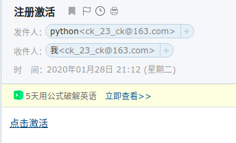

# celery

情景：用户发起request，并等待response返回。在本些views中，可能需要执行一段耗时的程序，那么用户就会等待很长时间，造成不好的用户体验，比如发送邮件、手机验证码等。

使用celery后，情况就不一样了。解决：将耗时的程序放到celery中执行。

* 点击查看[celery官方网站](http://www.celeryproject.org/)
* 点击查看[celery中文文档](http://docs.jinkan.org/docs/celery/)

celery名词：

* 任务task：就是一个Python函数。
* 队列queue：将需要执行的任务加入到队列中。
* 工人worker：在一个新进程中，负责执行队列中的任务。
* 代理人broker：负责调度，在布置环境中使用redis。

安装包：
```
celery==3.1.25
django-celery==3.1.17
```

# 布署

当项目开发完成后，需要将项目代码放到服务器上，这个服务器拥有固定的IP，再通过域名绑定，就可以供其它人浏览，对于python web开发，可以使用wsgi、apache服务器，此处以wsgi为例进行布署。

服务器首先是物理上的一台性能高、线路全、运行稳定的机器，分为私有服务器、公有服务器。

* 私有服务器：公司自己购买、自己维护，只布署自己的应用，可供公司内部或外网访问，成本高，需要专业人员维护，适合大公司使用。
* 公有服务器：集成好运营环境，销售空间或主机，供其布署自己的应用，适合初创公司使用，成本低。

常用的公有服务器，如阿里云、青云等，可按流量收费或按时间收费。服务器还需要安装服务器软件，此处需要uWSGI、Nginx。

服务器架构如下图：

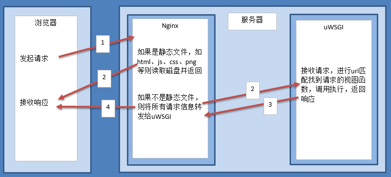


