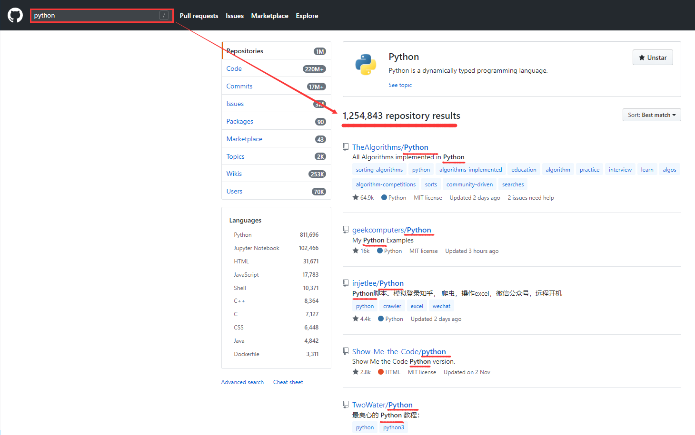
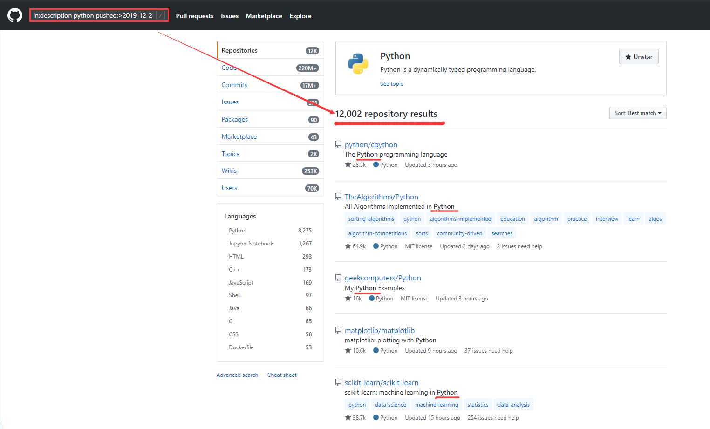
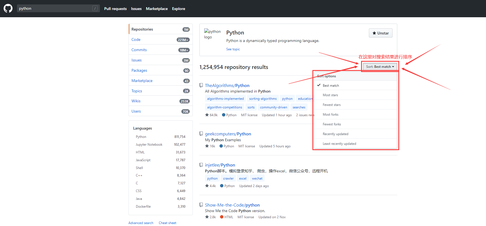

<!-- TOC -->

- [github 搜索技巧](#github-搜索技巧)
  - [案例](#案例)
    - [普通搜](#普通搜)
  - [搭配技巧搜](#搭配技巧搜)
  - [限定词](#限定词)
    - [查找某个用户或组织的项目](#查找某个用户或组织的项目)
  - [辅助限定词](#辅助限定词)
  - [还没搞懂的（关于 forks、mirror、issues）](#还没搞懂的关于-forksmirrorissues)
  - [排序（放的是官网的链接）](#排序放的是官网的链接)
  - [使用指南](#使用指南)
    - [练习案例](#练习案例)

<!-- /TOC -->

# github 搜索技巧
参考自 B站 up 主 CodeSheep 的视频【[如何高效地在网上找开源项目做！在职程序员实际演示一波视频教程操作](https://www.bilibili.com/video/av75587104)】，然后写着写着一好奇就去看文档了

现在这篇博客相当于官方文档的翻译版😂

当然，你也可以去看【[官方文档](https://help.github.com/en/github/searching-for-information-on-github/searching-on-github)】体验原汁原味的教程

## 案例
### 普通搜
关键词：`python`



## 搭配技巧搜
搜索 github 中，项目描述（description）中有 python 并且 2019-12-20 号之后有更新过的项目
```
in:description python pushed:>2019-12-20
```
效果：加了限制条件后，查出来的项目数有了明显的减少



## 限定词

可通过指定 仓库名(repository name)、项目描述(description)、内容(contents)、说明文件(readme.md) 来搜索项目

| 限定词          | 案例                                                                                |
| --------------- | ----------------------------------------------------------------------------------- |
| `in:name`         | `in:name python` 查出仓库名中有 python 的项目（python in:name 也是一样的）            |
| `in:description`  | `in:name,description python` 查出仓库名或者项目描述中有 python 的项目                 |
| `in:readme`       | `in:readme python` 查出 `readme.md` 文件里有 python 的项目                              |
| `repo:owner/name` | `repo:octocat/hello-world` 查出 octocat 的 hello-world 项目（指定了某个人的某个项目） |

其他骚操作？自己看官方文档（感觉用不到，就不整理了吧）：【[找仓库中的某个文件](https://help.github.com/en/github/searching-for-information-on-github/finding-files-on-github)】、【[在 github 上查找代码片段](https://help.github.com/en/github/searching-for-information-on-github/searching-code)】

### 查找某个用户或组织的项目

| 限定词        | 案例                                                                    |
| ------------- | ----------------------------------------------------------------------- |
| `user:USERNAME` | `user:1335951413 stars:<10` 查出用户 1335951413 名下 stars 少于 10 的项目 |
| `org:ORGNAME`   | `org:github` 查出 github 名下的项目                                       |

## 辅助限定词
可以通过限制 项目大小(size)、拥护者数(followers)、fork数(forks)、stars数(stars)、创建时间(created)、更新时间(pushed)、项目所用语言(language)、topic标签(topic)、topic标签数(topics)... 来筛选项目

辅助限定词可以多个并用，用空格隔开就行，可以搭配限定词使用，也可单独使用

（关于项目是否被 fork 这个点我不是很懂，就不写案例了）

* `in:name python size:<=1000` 查出项目名字中有 python 且小于 1MB 的项目

* `size:<=1000` 查出项目大小小于 1MB 的项目

| 限定词                                                                                                             | 案例                                                                                                                                           |
| ------------------------------------------------------------------------------------------------------------------ | ---------------------------------------------------------------------------------------------------------------------------------------------- |
| `stars:n`                                                                                                          | `stars:>=5` 查出 star数大于等于 5 个 的项目（支持大于小于区间等）                                                                              |
| `pushed:YYYY-MM-DD`                                                                                                | `css pushed:>2013-02-01` 查出仓库中包含 css 关键字，并且在 2013年1月 之后更新过的项目                                                          |
| `language:LANGUAGE`                                                                                                | `rails language:javascript` 查出仓库包含 rails 关键字，并且使用 javscript 语言的项目                                                           |
| `created:YYYY-MM-DD`                                                                                               | `webos created:<2011-01-01` 查出仓库中包含 webos 关键字并且是在 2011 年之前创建的项目（也支持时分秒，支持大于小于区间等）                      |
| `size:n`                                                                                                           | `size:1000` 查出仓库大小等于 1MB 的项目, `size:>=30000` 查出仓库大小至少大于 30MB 的项目, `size:50..120` 查出仓库大小在 50KB 至 120KB 之间的项目 |
| `followers:n`                                                                                                      | `followers:1000` 查出有 1000 个拥护者（followers） 的项目（支持大于小于区间等）                                                                |
| `forks:n`                                                                                                          | `forks:5` 查出有 5 个 forks 的项目（支持大于小于区间等）                                                                                       |
| `topic:TOPIC`                                                                                                      | `topic:jekyll` 查出含有 jekyll 这个 topic 的项目（项目描述下面的东西，相当于标签、分类）                                                       |
| `topics:n`                                                                                                         | `topics:>5` 查出有 5 个以上 topic 的项目（支持大于小于区间等）                                                                                 |
| `archived:true/false`                                                                                              | `archived:true GNOME` 查出已经封存了并且含有 GNOME 关键字的项目（已经不再维护了的项目）                                                        |
| `is:public/private`                                                                                                | `is:public org:github` 查出仓库所有组织是 github 并且公开的项目                                                                                |
| `is:private github` 查出含有 github 关键字并且是私有的项目（私有的别人看不到，所以这个是用来搜索自己的私有项目的） |                                                                                                                                                |
| `license:LICENSE_KEYWORD`                                                                                          | `license:apache-2.0` 查出仓库的开源协议是 apache-2.0 的                                                                                        |

## 还没搞懂的（关于 forks、mirror、issues）
[stars:>=500 fork:true language:php](https://github.com/search?q=stars%3A%3E%3D500+fork%3Atrue+language%3Aphp&type=Repositories) matches repositories with the at least 500 stars, including forked ones, that are written in PHP.

[case pushed:>=2013-03-06 fork:only](https://github.com/search?q=case+pushed%3A%3E%3D2013-03-06+fork%3Aonly&type=Repositories) matches repositories with the word "case" that were pushed to on or after March 6th, 2013, and that are forks.
[mirror:true GNOME](https://github.com/search?utf8=%E2%9C%93&q=mirror%3Atrue+GNOME&type=) matches repositories that are mirrors and contain the word "GNOME." 查出是镜像并且包含 GNOME 关键字的项目（github 上 mirror 啥意思不太懂）
[mirror:false GNOME](https://github.com/search?utf8=%E2%9C%93&q=mirror%3Afalse+GNOME&type=) matches repositories that are not mirrors and contain the word "GNOME."
[good-first-issues:>2 javascript](https://github.com/search?utf8=%E2%9C%93&q=javascript+good-first-issues%3A%3E2&type=) matches repositories with more than two issues labeled good-first-issue and that contain the word "javascript."
[help-wanted-issues:>4 react](https://github.com/search?utf8=%E2%9C%93&q=react+help-wanted-issues%3A%3E4&type=) matches repositories with more than four issues labeled help-wanted and that contain the word "React."

## 排序（放的是官网的链接）
推荐直接在页面上的搜索结果点击排序，何必再去学一手呢？

官网文档：【[给你的查询结果排序](https://help.github.com/en/github/searching-for-information-on-github/sorting-search-results)】




## 使用指南
自己灵活的使用限定词和辅助限定词写出一套规则即可查出你想要的项目

他们的位置先后、数量都无所谓，加上只是多了一个条件

### 练习案例
常用到的其实有就是这些，上面的还是太多了，你有那个需求，又找不到方式的时候可以查查看
```
# 项目名字(name)里有 python 的
in:name python

# 名字(name)里有 python 的并且 stars 大于 3000 的
in:name python starts:>3000

# 名字(name)里有 python 的并且 stars 大于 3000 、forks 大于 200 的
in:name python starts:>3000 forks:>200


# 详情(readme)里面有 python 的并且 stars 大于 3000 的
in:readme python starts:>3000

# 描述(description)里面有 python 的并且 stars 大于 3000 的
in:description python starts:>3000

# 描述(description)里面有 python 的并且是 python 语言的
in:description python language:python

# 描述(description)里面有 python 的并且 2019-12-20 号之后有更新过的
in:description python pushed:>2019-12-20
```


