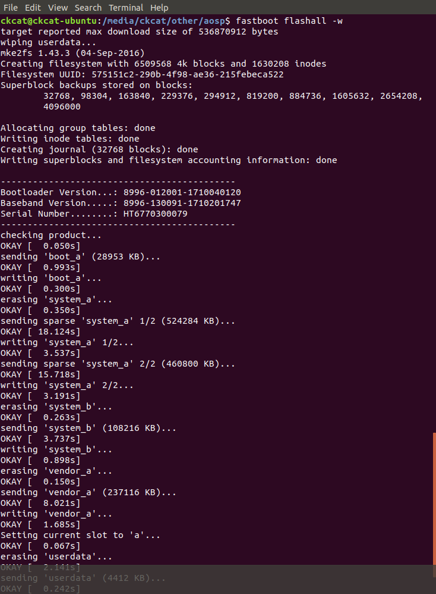
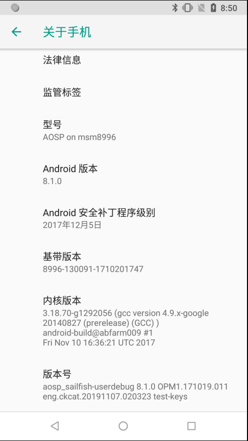
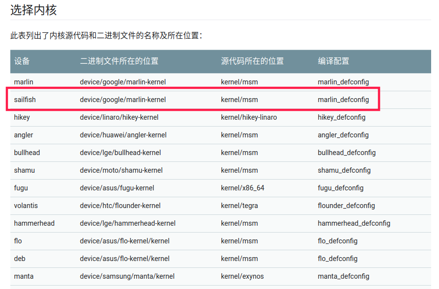
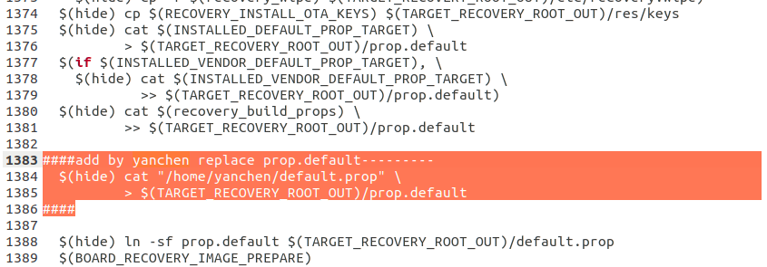
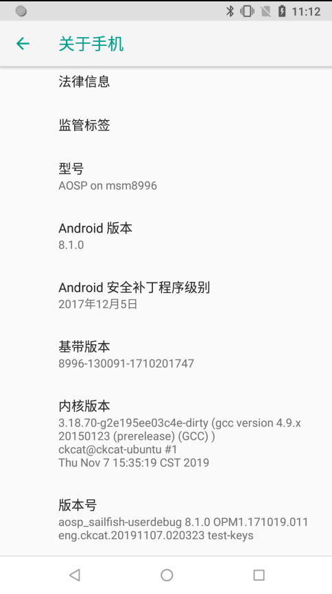

> 系统环境：Ubuntu 18.04.3
> 
> 编译Android系统版本： 8.1
<!-- TOC -->

- [一、下载源码](#一下载源码)
  - [1. 下载repo工具](#1-下载repo工具)
  - [2. 下载Android源码](#2-下载android源码)
  - [3. android源码查看所有分支切换分支](#3-android源码查看所有分支切换分支)
- [二、配置编译环境](#二配置编译环境)
  - [1. 安装 JDK](#1-安装-jdk)
  - [2. 安装编译所需要的包](#2-安装编译所需要的包)
  - [3. 下载驱动](#3-下载驱动)
  - [4. 编译](#4-编译)
  - [5. 刷机](#5-刷机)
- [三、编译内核并刷机](#三编译内核并刷机)
  - [1. 获取内核源码](#1-获取内核源码)
  - [2. 编译](#2-编译)
- [四、错误处理](#四错误处理)
  - [1. `flex-2.5.39: loadlocale.c:130: _nl_intern_locale_data: Assertioncnt < (sizeof (_nl_value_type_LC_TIME) / sizeof (_nl_value_type_LC_TIME[0]))' failed.` 错误。](#1-flex-2539-loadlocalec130-_nl_intern_locale_data-assertioncnt--sizeof-_nl_value_type_lc_time--sizeof-_nl_value_type_lc_time0-failed-错误)
  - [2. adb和fastboot都没有权限](#2-adb和fastboot都没有权限)

<!-- /TOC -->

# 一、下载源码
由于国内网络环境问题，下列下载源码方式均未采用google官方提供的方式。
## 1. 下载repo工具
使用清华mirror下载repo工具
```
$ curl https://mirrors.tuna.tsinghua.edu.cn/git/git-repo -o repo
$ chmod +x repo
```
然后设置更新源：
```
export REPO_URL='https://mirrors.tuna.tsinghua.edu.cn/git/git-repo/'
```

## 2. 下载Android源码

因为Android的源码越来越大，repo sync失败的概率也越来越高。
所以我们可以避开使用repo sync的方式，而采用下载预下载包的方式来实现：
```
$ wget -c https://mirrors.tuna.tsinghua.edu.cn/aosp-monthly/aosp-latest.tar # 下载初始化包
$ tar xf aosp-latest.tar
$ cd aosp   # 解压得到的 aosp 工程目录
$ repo init -u https://aosp.tuna.tsinghua.edu.cn/platform/manifest -b android-8.1.0_r1	
$ repo sync # 正常同步一遍即可得到完整目录
```
> 参考：https://mirrors.tuna.tsinghua.edu.cn/

这里考虑到网络问题，sync的过程中可能会意外断开，我们不可能一直守着看的，所以通过下面的脚本来完成代码的下载。将下面的内容保存为`start_repo.sh`，然后该脚本执行权限`chmod a+x start_repo.sh`，然后就是等待了，推荐晚上睡觉扔在那里下载，第二天就可以用了。
```
#!/bin/bash  
echo "======start repo sync======"  
./repo sync -j4
while [ $? = 1 ]; do  
        echo "======sync failed, re-sync again======"  
        sleep 3  
        ./repo sync -j4 
done 
```

如果不想使用上述方式下载源码，可以使用国内用户提供的百度云盘连接下载：
```
http://pan.baidu.com/s/1ngsZs
```
以上连接来源自[此处](https://testerhome.com/topics/2229)。

## 3. android源码查看所有分支切换分支
```
cd .repo/manifests
git branch -a   #查看所有分支

repo init -b android-4.1.2_r1   # 切换分支
repo sync
```

# 二、配置编译环境
## 1. 安装 JDK
官方Android版本与JDK版本说明：
```
Android 7.0 (Nougat) - Android 8.0 (O)：Ubuntu - OpenJDK 8；Mac OS - jdk 8u45 或更高版本
Android 5.x (Lollipop) - Android 6.0 (Marshmallow)：Ubuntu - OpenJDK 7；Mac OS - jdk-7u71-macosx-x64.dmg
Android 2.3.x (Gingerbread) - Android 4.4.x (KitKat)：Ubuntu - Java JDK 6；Mac OS - Java JDK 6
Android 1.5 (Cupcake) - Android 2.2.x (Froyo)：Ubuntu - Java JDK 5
```
安装 `openjdk-8-jdk` :
```
sudo apt-get update
sudo apt-get install openjdk-8-jdk
```

## 2. 安装编译所需要的包
```
sudo apt-get install libx11-dev:i386 libreadline6-dev:i386 libgl1-mesa-dev g++-multilib 
sudo apt-get install -y git flex bison gperf build-essential libncurses5-dev:i386 
sudo apt-get install tofrodos python-markdown libxml2-utils xsltproc zlib1g-dev:i386 
sudo apt-get install dpkg-dev libsdl1.2-dev libesd0-dev
sudo apt-get install git-core gnupg flex bison gperf build-essential  
sudo apt-get install zip curl zlib1g-dev gcc-multilib g++-multilib 
sudo apt-get install libc6-dev-i386 
sudo apt-get install lib32ncurses5-dev x11proto-core-dev libx11-dev 
sudo apt-get install libgl1-mesa-dev libxml2-utils xsltproc unzip m4
sudo apt-get install lib32z-dev ccache

```
> libesd0-dev包安装不上的解决方法：
使用 `sudo vim /etc/apt/sources.list` 打开 `sources.list` 文件,在末尾添加下列内容：
```
deb http://kr.archive.ubuntu.com/ubuntu/ xenial main universe
deb-src http://kr.archive.ubuntu.com/ubuntu/ xenial main universe
```
然后 `sudo apt update` ，最后安装 `sudo apt-get install dpkg-dev libsdl1.2-dev libesd0-dev` 。

## 3. 下载驱动
根据手机型号和Android版本下载对应的驱动
```
https://developers.google.com/android/drivers
```
下载完成后解压到`aosp`目录，并执行对应的脚本,最终会产生一个`vendor`目录。


## 4. 编译
首先运行`source build/envsetup.sh`:


执行 `lunch` ,选择需要编译的版本,执行 `make -j16` 进行编译。


编译成功


## 5. 刷机
为了保险期间，建议更新bootloader到相应的版本,可以去官方下载刷机包，刷入对应的bootloader，我这里就是遇到了这个坑。
> https://developers.google.com/android/images/#sailfish


**刷机前，需要特别注意在 `setting->User & accounts` 中将 Google account remove 掉，否则刷完机后会要求登录刷机前的 Google 账户才允许进入 launcher 界面。这一点是需要特别注意的。**

首先`adb reboot bootloader`进入bootloader模式，然后进入下载好的刷机包，执行`./flash-base.sh`即可更行`bootloader`和`radio`了。

然后将路径切换到`out/target/product/sailfish`下，下面我们刷入其他镜像文件

> 首先是`boot.img`，执行`fastboot flash boot_a boot.img` 和 `fastboot flash boot_b boot.img` 。

> 接下来是`system.img`，执行`fastboot flash system system.img` 和 `fastboot flash system_b system_other.img` 。

> 最后是`vendor.img`，执行`fastboot flash vendor vendor.img` 。

当然如果你有自己定义，例如破解电信4G的modem，可以执行fastboot flash modem modem.img
最后通过fastboot reboot，重启手机。

上列命令也可以使用下列命令进行替代
```
fastboot flashall -w
```
> 注意：此命令会在当前文件夹中查找全部img文件，将这些img文件烧写到全部相应的分区中，并又一次启动手机。



其他命令
```
//清空分区
# fastboot erase boot
# fastboot erase system
# fastboot erase data
# fastboot erase cache
上面的命令也可以简化成一条命令
fastboot erase system -w
 
//单刷
//最重要刷boot.img、system.img、userdata.img、vendor.img这四个固件.
# adb reboot bootloader 
# fastboot flash boot boot.img
# fastboot flash system system.img
# fastboot flash userdata userdata.img
# fastboot flash vendor vendor.img 
# fastboot flash recovery recovery.img //没有编出来，可选
# fastboot flash cache cache.img //没有编出来，可选
# fastboot flash persist persist.img //没有编出来，可选
# fastboot reboot

```
**遇到的坑**

我的手机版本是7.1.2的，然后直接刷机，开机后开机画面一闪而过，然后无限重启循环这个过程。

**解决**

先刷官方8.1的系统，在刷自己编译的8.1系统就可以了，具体原因就是bootloader没有更新到相应的版本。

下图为刷机成功的的手机系统信息。


# 三、编译内核并刷机
## 1. 获取内核源码
进入到源码根目录下的kernel文件夹中执行`git clone https://aosp.tuna.tsinghua.edu.cn/kernel/msm`,就可以下载到相应msm的内核源码了。
通过`https://source.android.com/source/building-kernels`页面找到设备对应的源码位置。



通过`git branch -r|grep marlin-kernel`命令查找对应的分支，然后通过`git checkout remotes/origin/android-msm-marlin-3.18-oreo-mr1`切换分支获取到源码。

## 2. 编译
修改内核目录下的 `Makefile` 文件，修改内容如下：
```
 # Note: Some architectures assign CROSS_COMPILE in their arch/*/Makefile
- ARCH           ?= $(SUBARCH)
- CROSS_COMPILE  ?= $(CONFIG_CROSS_COMPILE:"%"=%)
+ ARCH           ?= arm64
+ CROSS_COMPILE  ?= aarch64-linux-android-
+ SUBARCH           ?= arm64
+ CROSS_COMPILE_ARM32  ?= arm-linux-androideabi-
 
 # Architecture as present in compile.
```
回到`aosp`目录进行`source`，`lunch`操作，然后进入msm目录执行`make marlin_defconfig`，得到`.config`文件后，直接执行`make -j4`即可。

在编译过程中出现如下错误：
```
/bin/sh: 1: lz4c: not found
arch/arm64/boot/Makefile:36: recipe for target 'arch/arm64/boot/Image.lz4' failed
```


显然是`lz4c`没有找到，应该就是有依赖工具没有安装，通过`sudo apt-get install liblz4-tool` 安装即可，继续`make -j4`编译，最后得到`arch/arm64/boot/Image.lz4-dtb` 。


将上面编译得到的Image.lz4-deb文件复制到aosp源码目录下的device/google/marlin-kernel路径即可，然后到aosp源码根目录下执行 `make bootimage` 。


或者按下列命令生成 boot.img 
```
export TARGET_PREBUILT_KERNEL=/media/ckcat/other/aosp/msm/arch/arm64/boot/Image.lz4-dtb
rm out/target/product/sailfish/boot.img &&  make bootimage
```
如果想要替换 `boot.img` 中的 `default.prop`,可以在 `build/core/Makefile` 中搜索关键字 `TARGET_RECOVERY_ROOT_OUT)/default.prop` 做如下修改，[参考](https://blog.csdn.net/XXOOYC/article/details/85679143):


最后按照前面所写的内容，使用`fastboot flash boot_a boot.img` 和 `fastboot flash boot_b boot.img` 刷入即可。如下截图可以看到kernel是使用`ckcat`的机器编译的。



> 参考: https://blog4jimmy.com/2018/02/418.html

# 四、错误处理
## 1. `flex-2.5.39: loadlocale.c:130: _nl_intern_locale_data: Assertioncnt < (sizeof (_nl_value_type_LC_TIME) / sizeof (_nl_value_type_LC_TIME[0]))' failed.` 错误。

bing 搜索之，在这个[链接中找到解法](https://stackoverflow.com/questions/49955137/error-when-build-lineageos-make-ninja-wrapper-error-1)。

```
export LC_ALL=C
```
把这行代码添加到bashrc 文件中。
实测有效。

那么这句配置是什么意思呢？
搜索得到：
LC_ALL=C 是为了去除所有本地化的设置，让命令能正确执行。

> 原文链接：https://blog.csdn.net/aaa111/article/details/80330848

## 2. adb和fastboot都没有权限

> 可以参考https://github.com/snowdream/51-android